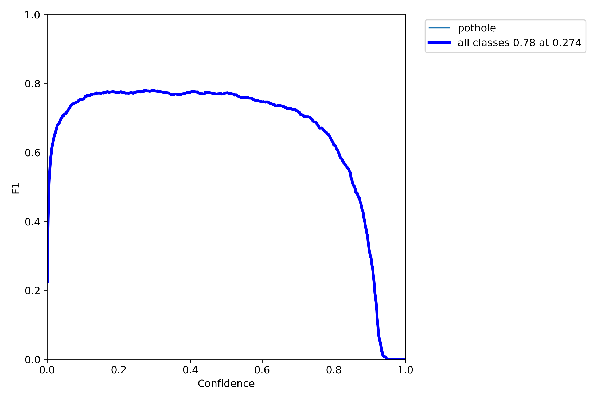
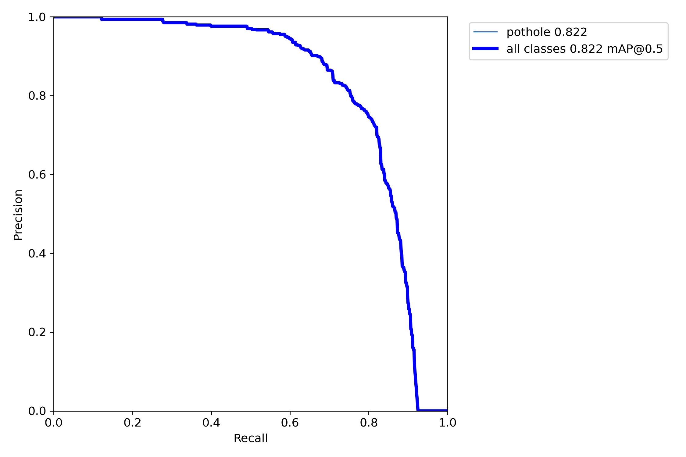
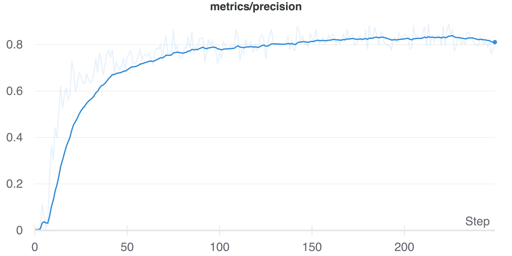
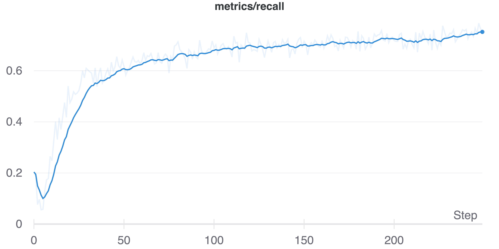
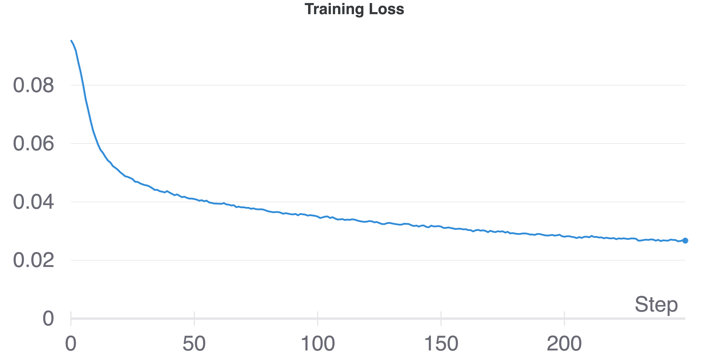
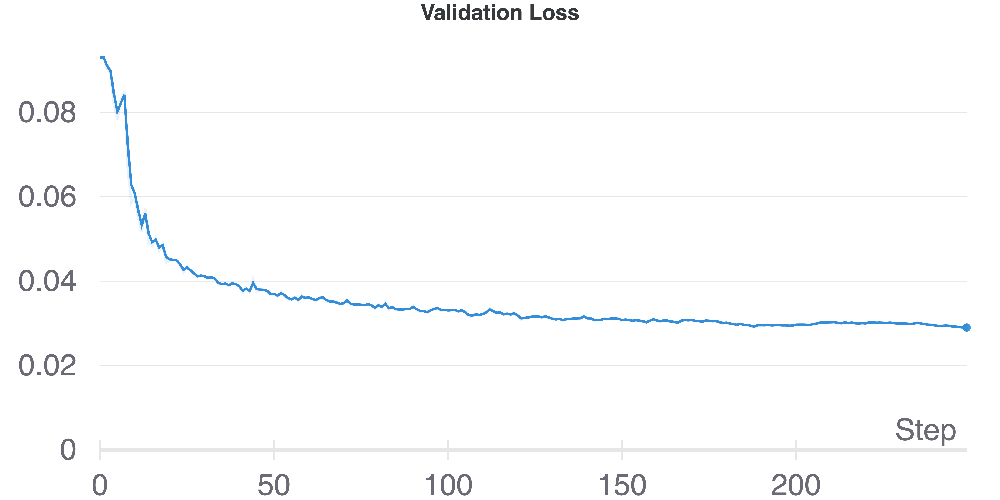

# PotHole

The **Pothole-App** is designed to identify and localize poor road conditions, specifically potholes, using real-time image analysis from mobile streams. The main features include:

- **Real-time Pothole Detection:** Utilizes YOLOv5 trained on a custom dataset to detect potholes in mobile camera streams.
- **GPS Integration:** Stores position/GPS coordinates along with detected potholes.
- **GIS Mapping:** Maps detected potholes onto geological (GIS) maps for administrative purposes.

[Download Pothole-App](https://github.com/InformationServiceSystems/Pothole-App/blob/main/src/android/app/release/app-release.apk) | [Collected Dataset](https://github.com/InformationServiceSystems/Pothole-App/tree/main/dataset)


---

## Data Preparation
Before generating the pothole detection model, follow the data preparation steps outlined in [data_preparation.ipynb](pothole_data_prepration.ipynb). The dataset must be structured in the YOLOv5-compatible format (COCO) before merging:

```
data_root_dir
    ├── test
    │   ├── images
    │   ├── labels
    ├── train
    │   ├── images
    │   ├── labels
    ├── valid
    │   ├── images
    │   ├── labels
    ├── data.yaml
    ├── log.txt
```

The prepared dataset can be accessed via the following link:  
[Download Pothole Dataset](https://drive.google.com/file/d/1-lScdLoaW_yzuvQ9nph7raL76wuHz5v_/view?usp=sharing).

---

## Model Training
To generate the YOLOv5 model for pothole detection, follow these steps:

1. Clone the YOLOv5 repository (v5.0):
    ```bash
    git clone -b v5.0 https://github.com/ultralytics/yolov5.git
    ```
2. Copy the custom YOLOv5 configuration file:
    ```bash
    cp models/pothole_yolov5s.yaml yolov5/models/
    cd yolov5
    ```
3. Install the necessary dependencies (using Python/Conda environment is recommended):
    ```bash
    pip3 install -r requirements.txt
    pip3 install wandb
    ```
4. Train the model:
    ```bash
    python3 train.py --project pothole_detection --epochs 300 --name yolov5s_pothole_results \
    --data ../../../data_root_dir/data.yaml --cfg models/pothole_yolov5s.yaml --cache
    ```
   **Note:** If you encounter errors, clear the training and validation cache from the dataset folder.

---

## Model Performance
The following figures demonstrate the model's performance:

  
  
  
  
  
  

---

## Deployment on Mobile Devices
To deploy the trained model on a mobile device, follow these steps:

1. Ensure TensorFlow **>=2.4.0** is installed:
    ```bash
    pip3 install tensorflow==2.4.0
    python3 -c "import tensorflow as tf; print(tf.reduce_sum(tf.random.normal([1000, 1000])))"
    ```
2. Convert the trained model to TensorFlow format:
    ```bash
    PYTHONPATH=. python models/tf.py --weights weights/best.pt --cfg models/pothole_yolov5s.yaml --img 320
    ```
    This will generate:
    - `best.pb`
    - `best_saved_model`
    - `best-fp16.tflite`

3. Verify the converted model:
    ```bash
    python3 detect.py --weights weights/best-fp16.tflite --img 320
    ```
    Check the results in the `run/detect/exp` folder.

4. **(Optional)** Deploy an **INT8 quantized model** for better efficiency:
    ```bash
    PYTHONPATH=. python models/tf.py --weights weights/best.pt --cfg models/pothole_yolov5s.yaml --img 320 --tfl-int8 --source calib --ncalib 100
    ```
    Verify the model:
    ```bash
    python3 detect.py --weights weights/best-int8.tflite --img 320 --tfl-int8
    ```

5. Copy the TFLite model to the Android app folder:
    ```bash
    cp weights/best-fp16.tflite android/app/src/main/assets/
    ```
6. Connect an Android device and run the project from **Android Studio**.

---

## License
This project is licensed under the [MIT License](LICENSE).

For more details, check out the [Project Presentation](https://github.com/InformationServiceSystems/Pothole-App/blob/main/documentation/Pothole_slides.pptx).
