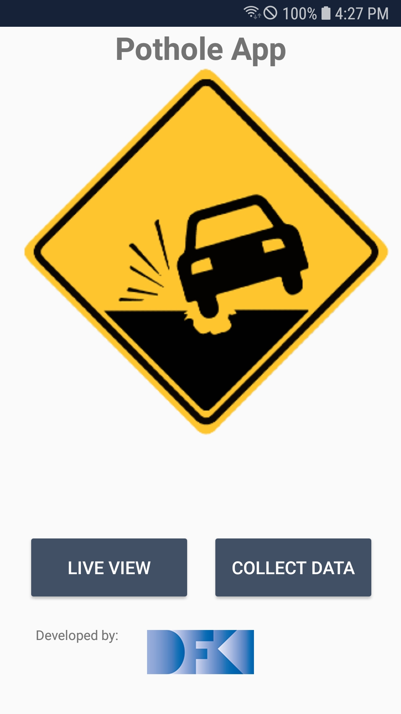

**Responsible Person:** Maxx Richard Rahman

[Project Presentation](https://github.com/InformationServiceSystems/Pothole-App/blob/main/documentation/Pothole_slides.pptx)
# Pothole-App

[Download Pothole-App](https://github.com/InformationServiceSystems/Pothole-App/blob/main/src/android/app/release/app-release.apk)

[Collected Dataset](https://github.com/InformationServiceSystems/Pothole-App/tree/main/dataset)




## Project Description    
    1. Identifying and localizing poor road conditions (mainly potholes) based on real-time images from mobile streams.
    2. Store position/GPS-Coordinates of the mobile to save alongwith detected potholes.
    3. Mapping of potholes on geological (GIS) maps for administrative units.

To detect potholes from input stream we have used Yolov5 trained with a custom dataset. 

## Data Preparation
Before running pothole_detection model generation, please check how to perform data preparation task using [data_preparation](pothole_data_prepration.ipynb).
Every dataset needs to be converted into yolov5 desired format (coco) before merging. Following is the dataset scheme and respective structure

    data_root_dir
        test
            images
            labels
        
        train
            images
            labels
        
        valid
            images
            labels
    data.yaml
    log.txt
Prepared data can be directly accessed via following link [pothole_dataset](https://drive.google.com/file/d/1-lScdLoaW_yzuvQ9nph7raL76wuHz5v_/view?usp=sharing). Organize dataset as above mentioned scheme.

## Model Generation
For model generation follow following steps

1. clone yolov5 version 5.0 
```
git clone -b v5.0 https://github.com/ultralytics/yolov5.git
```

2. copy "models/pothole_yolov5s.yaml" into yolov5/models/
```
cp models/pothole_yolov5s.yaml yolov5/models/
cd yolov5
```

3. Install all liabraries required for training (better using python/conda env)
```
pip3 install -r requirements.txt
pip3 install wandb
```

4. Run following command to train yolov5 for pothole (make sure dataset is arranged as above).
```
python3 train.py --project pothole_detection --epochs 300 --name yolov5s_pothole_results --data ../../../data_root_dir/data.yaml --cfg models/pothole_yolov5s.yaml --cache
```
in case of error, go into dataset folder and remove training and validation cache. For model evaluation feel free to use wandb or tensorboard.


## Model Performance


## Deployment

To deploy model on mobile device, follow these steps

1. Make sure tensorflow >=2.4.0 is installed, you can check running following command.
```
pip3 install tensorflow==2.4.0
python3 -c "import tensorflow as tf;print(tf.reduce_sum(tf.random.normal([1000, 1000])))"
```

2. Place trained yolov5 model into src/weights and run following command, feel free to change resolution
```
PYTHONPATH=. python models/tf.py --weights weights/best.pt --cfg models/pothole_yolov5s.yaml --img 320
```
this will generate multiple files, best.pb, best_saved_model and best-fp16.tflite.

3. To varify the working of best-fp16.tflite model run following command
```
python3 detect.py --weights weights/best-fp16.tflite --img 320
```
You can go to run/detect/exp folder and check the results.

4. (optional) To deploy int8 quantized model execute following command (make sure calib folder is present in current directory)

```
PYTHONPATH=. python models/tf.py --weights weights/best.pt --cfg models/pothole_yolov5s.yaml --img 320 --tfl-int8 --source calib --ncalib 100
```
To varify the working of best-int8.tflite model run following command
```
python3 detect.py --weights weights/best-int8.tflite --img 320 --tfl-int8
```

5. Place tflite model into app folder (android/app/src/main/assets).


You can connect android device and run project from android studio.
