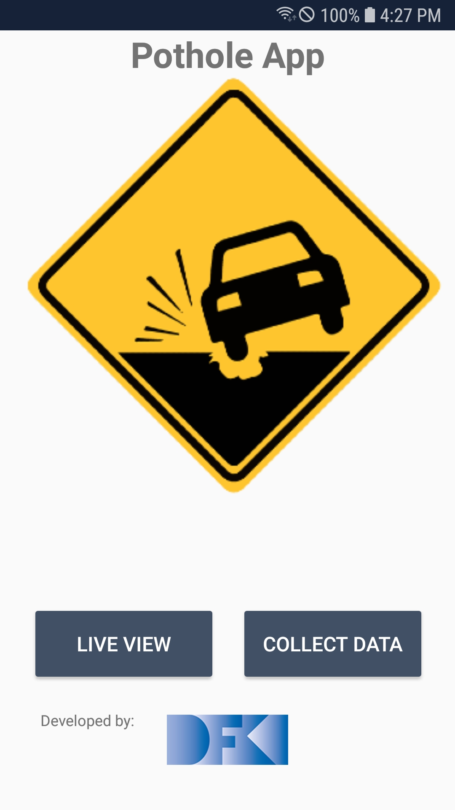
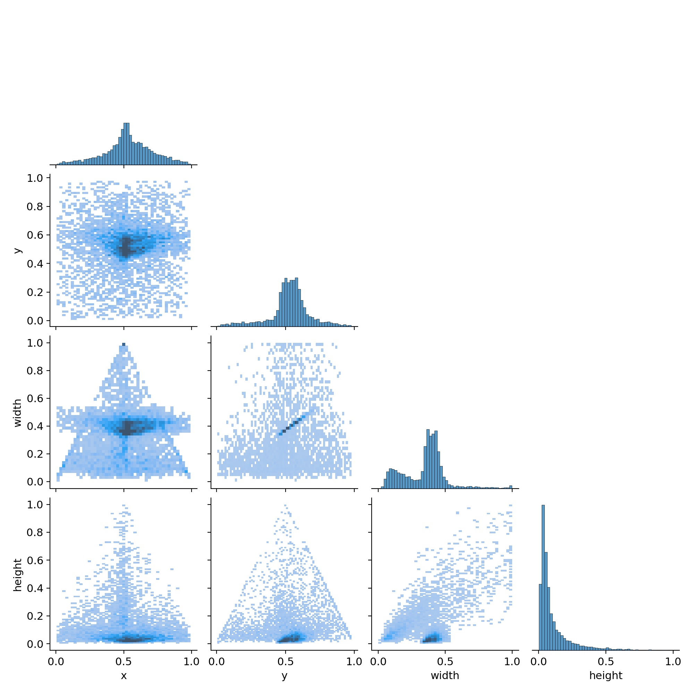
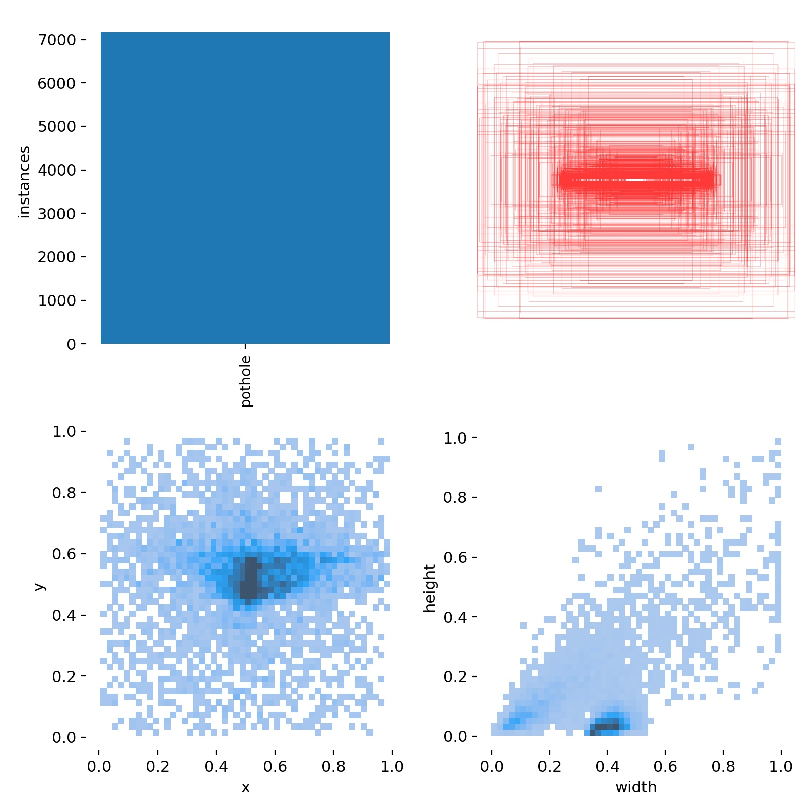

# Pothole-App

App Location: src/android/app/release/app-release.apk

This project aims at 
    
    1. Identifying and localizing poor road conditions (mainly potholes) based on real-time images from mobile streams.
    2. Store position/GPS-Coordinates of the mobile to save alongwith detected potholes.
    3. Mapping of potholes on geological (GIS) maps for administrative units.
    

# Pothole Detection(in discriminative settings)
YOLOv5 is a family of object detection architectures pretrained on the COCO dataset. Being a robust object detector, making it ideal for various computer vision applications. 

# Challenges
In this work we have to deal with various challenges 
## Dataset
In this project three datasets were combined to increase the robustness of the model: 

    1. "Road Pothole Images for Pothole Detection" from Rath 2020. 
    2. "scraped images from the internet" by Praramadhan 2021. 
    3. "roboflow dataset" by Atikur Chitholian 2020. 

In addition every dataset needs to be converted into yolov5 desired format (coco). However, these datasets are not sufficient (limited ~3000 images) to attain a high level of generalization. 

Figure shows the overall data distribution of potholes from dataset. Mainly there are ~7000 pothole instances in ~3000 images. Above figures also demonstrates pothole avg spatial resolution (width and hight), position in x and y and corresponing occurances. This analysis suggest that more effective dataset(s) is required. 

## Domain adaptation
As goal of the work is to capture potholes from mobile camera, the training dataset should also comprises of potholes images captured by mobile camera involving 

1. various camera-poses/orientation
2. varying focus (as focus is adaptive in mobile)
3. varying light/global illumination

## Parameter/Model tuning
To attain higher accuracy the relevant model hyper parameters needs to be tuned, in addition, a more complex model architecture (yolov5m, yolov5l, yolov5x) can be selected to get max throughput.

## Model Optimization
Pytorch/Tensorflow ML models are easy to handle when deployed on mobile/edge devices. However desired throughput can not be achieved without some compression and quantization of the ML model. These optimization strategies must not degrade the performance of the model.

